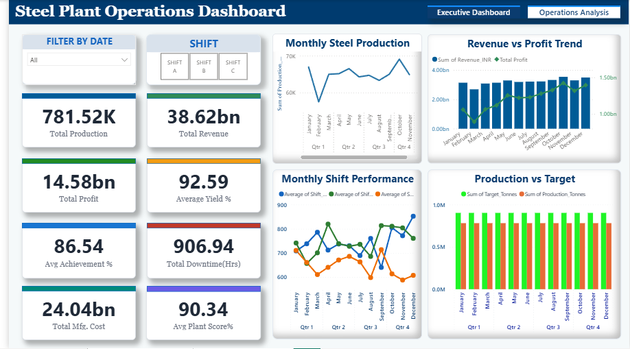

# Steel-Plant-Manufacturing-Analytics
End-to-end manufacturing analytics project using SQL, Python, and Power BI to analyze steel plant production, downtime, operational efficiency, and cost KPIs.

# Steel Plant Manufacturing Analytics Dashboard

## Project Overview

Developed an end-to-end manufacturing analytics solution to monitor and evaluate steel plant operations using SQL, Python, and Power BI. The project analyzes production performance, operational efficiency, downtime, manufacturing costs, quality metrics, and raw material trends to support data-driven decision making.

---

## Objectives

- Analyze daily steel production and operational KPIs.
- Monitor production efficiency against targets.
- Identify major causes of downtime.
- Evaluate profitability and manufacturing cost trends.
- Compare shift-wise production performance.
- Build an interactive dashboard for operational monitoring.

---

## Tech Stack

- MySQL
- Python (Pandas, NumPy, Matplotlib, Seaborn)
- Power BI
- Excel

---

## Dataset

The project is built using a simulated manufacturing dataset containing 365 days of operational data.

The dataset consists of four tables:

- Daily Steel Plant KPI
- Shift-wise Production
- Downtime Reason Breakdown
- Monthly Raw Material Prices

---

## Workflow

Data Collection  
↓    
SQL Data Analysis  
↓  
Python Data Processing & KPI Engineering  
↓  
Power BI Dashboard Development  
↓  
Business Insights  

---

## Dashboard Pages

### Executive Operations Dashboard

Features

- Production KPI Monitoring
- Revenue & Profit Analysis
- Production vs Target
- Shift-wise Performance
- Downtime Distribution
- Interactive Filters

### Manufacturing Performance Dashboard

Features

- Profitability Analysis
- Quality vs Yield Analysis
- Raw Material Price Trends
- Downtime Pareto Analysis
- Manufacturing Cost Insights
- Operational Performance Analysis

## Key Insights

- Evaluated production efficiency across 365 operational days.
- Identified major downtime contributors affecting manufacturing output.
- Compared shift-wise production performance to highlight operational trends.
- Analyzed relationships between production, profitability, and manufacturing costs.
- Tracked fluctuations in raw material prices impacting operational expenses.

## Repository Structure

Data/
SQL/
Python/
PowerBI/
Dashboard/
README.md
LICENSE

## Dashboard Preview

### Executive Dashboard

### Operational Analytics Dashboard

